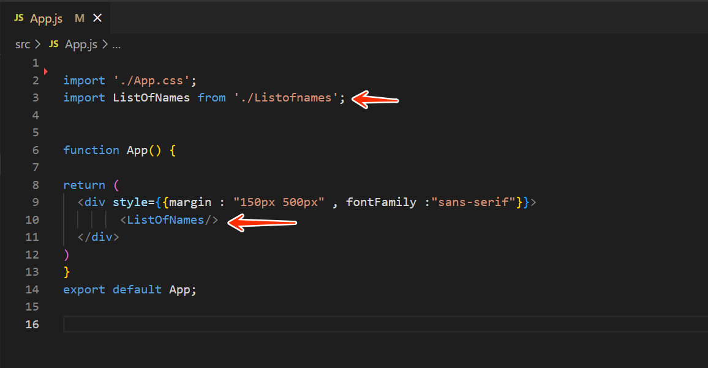

# My React Learning Journey
This repository is where I share small React components I built while learning.
They are simple, reusable, and focus on the logic rather than the styling (CSS is up to you )

## Some examples of the components you will find 
- **Counter.js** a basic counter that increases or decreases when you click the + and - buttons
- **ListOfNames** lets you add, edit, and delete items from a list.
- and moreee ... 

## HOW TO USE THEM 
- you will find all the components in the field **/src** 
- and this is an example of how you use each one

  

  ---
  **ps : the css is up to you choose the style you want , the most important is to get the logic behind every code and learn* 

  ### why this repo 
  1. To serve as my personal reference whenever I forget how to implement something in React.
  2. To help new learners practice and understand the basics through simple, practical examples.

    
  

  
